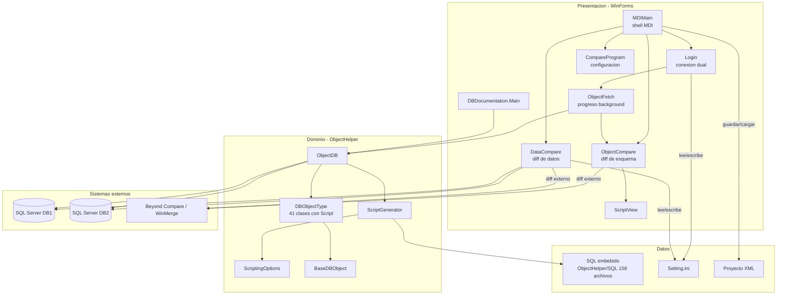
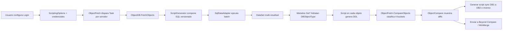

# Arquitectura — DBCompare

## 1. Vista de componentes

La solución sigue una separación en capas (presentación / dominio / datos), pero la capa de dominio (`ObjectHelper`) está fuertemente acoplada a tipos de WinForms/SMO en varios puntos, y la lógica de comparación vive dentro de los formularios en lugar de un servicio independiente.

## 2. Responsabilidades por capa

| Capa | Responsabilidad | Acoplamiento observado |
|---|---|---|
| **Presentación** (`DBCompare`, `DBDocumentation`) | UI, orquestación de flujos (login → fetch → compare → mostrar), invocación de herramientas externas | La lógica de comparación (`CompareObjects`, `QueryDatos`) vive en el code-behind de los formularios, no en una clase de dominio independiente |
| **Dominio** (`ObjectHelper`) | Extracción de metadatos, modelado de objetos de BD, generación de scripts DDL | `ObjectDB` es monolítico (~1740 líneas); algunos tipos de `DBObjectType` referencian `ScriptingOptions` con valores fijos (ver `Table.Script()`) |
| **Datos** | Scripts SQL embebidos, archivos INI, proyectos XML | Los INI/XML mezclan configuración de aplicación con credenciales en texto plano |

## 3. Flujo de datos general

## 4. Fortalezas de la arquitectura actual

- Separación clara entre extracción/scripting (`ObjectHelper`) y presentación (`DBCompare`/`DBDocumentation`): ambos ejecutables reutilizan el mismo núcleo.
- El patrón `DBObjectType` con `Script()` por tipo permite añadir nuevos tipos de objeto sin tocar el motor de fetch.
- El uso de un único batch SQL multi-resultset por servidor minimiza el número de round-trips de red durante el fetch.

## 5. Debilidades arquitectónicas

- **Lógica de negocio en la UI**: `CompareObjects`, `QueryDatos` y la generación de scripts de sincronización están en el code-behind de los formularios, lo que impide reutilizarlos (p. ej. en una CLI o servicio) y dificulta las pruebas unitarias.
- **Estado mutable compartido**: la misma instancia de `ScriptingOptions` se pasa a los fetches de DB1 y DB2 en [`ObjectFetch.cs`](../DBCompare/ObjectFetch.cs); si el fetch de un servidor deshabilita un flag (p. ej. `DataCompression` en servidores antiguos), el segundo servidor hereda esa mutación.
- **Selección de script sin fallback**: `ScriptGenerator` concatena `"{Categoria}_{ServerMajorVersion}.sql"` sin manejar versiones fuera del rango cubierto (7–17), lo que puede producir una excepción no controlada al leer un recurso embebido inexistente.
- **Persistencia de credenciales**: tanto `Setting.ini` como los proyectos XML guardan contraseñas en texto plano, mezclando configuración de aplicación con secretos.
- **Comparación de datos duplicada**: existe un script `SQL_DATA_COMPARE.sql` embebido en `ObjectHelper` que no se usa; `DataCompare.cs` reimplementa la misma lógica en C# generando SQL dinámico.
- **Sin capa de pruebas**: no hay proyecto de tests que valide `ScriptGenerator`, la hidratación de `ObjectDB` o la lógica de comparación.

Ver el detalle de cada hallazgo, su severidad y las acciones recomendadas en [bugs-y-mejoras.md](bugs-y-mejoras.md).
