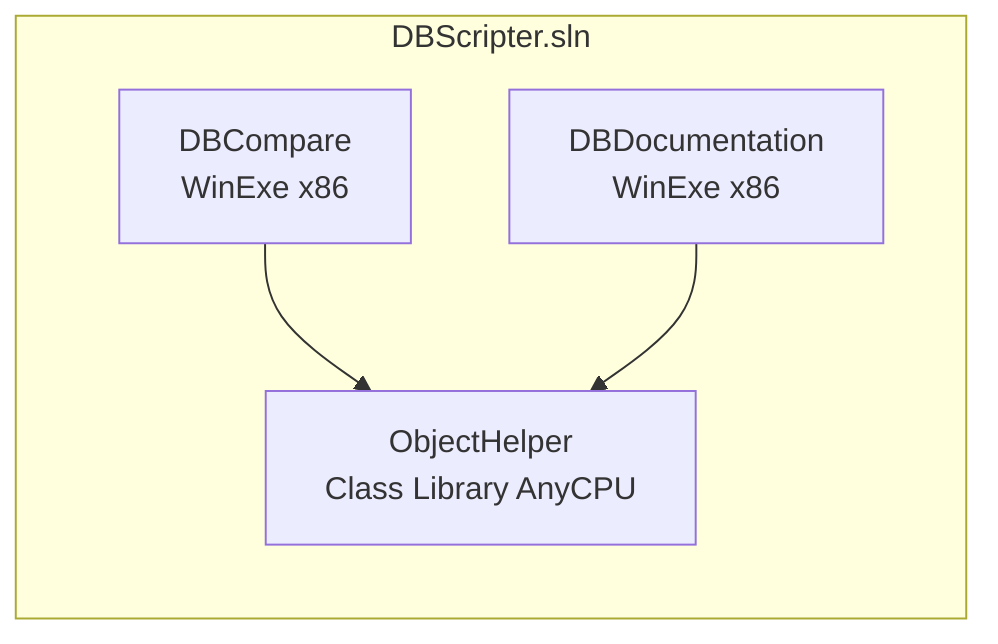

# Documento Técnico — DBCompare

## 1. Propósito

**DBCompare** es una herramienta de escritorio (Windows Forms) para comparar esquemas y datos entre dos bases de datos SQL Server, visualizar las diferencias y generar scripts DDL de sincronización. Incluye además una utilidad secundaria (**DBDocumentation**) para generar documentación HTML de un esquema.

El archivo de solución se llama `DBScripter.sln`, pero no existe ningún proyecto llamado `DBScripter`; es un nombre heredado del historial del repositorio.

## 2. Stack tecnológico

| Componente | Tecnología |
|---|---|
| Lenguaje | C# |
| Framework | .NET Framework 4.8 |
| UI | Windows Forms (MDI) |
| Formato de proyecto | csproj legacy + `packages.config` (no SDK-style) |
| Acceso a SQL Server | `Microsoft.Data.SqlClient` / `System.Data.SqlClient` + SMO (`Microsoft.SqlServer.SqlManagementObjects`) |
| Diff visual | `DiffPlex` (`InlineDiffBuilder`) |
| Serialización de proyectos | XML (`System.Xml`) |
| Configuración | Archivos `.ini` vía P/Invoke Win32 (`GetPrivateProfileString` / `WritePrivateProfileString`) |
| Comparación externa de datos/archivos | Beyond Compare o WinMerge (proceso externo) |

## 3. Estructura de la solución



| Proyecto | Tipo | Rol |
|---|---|---|
| [`DBCompare`](../DBCompare/DBCompare.csproj) | WinExe (x86) | Aplicación principal: shell MDI, login dual, comparación de esquema, comparación de datos, generación de scripts de sincronización, guardado/carga de proyectos XML |
| [`DBDocumentation`](../DBDocumentation/DBDocumentation.csproj) | WinExe (x86) | Generador de documentación HTML de un esquema (índice de objetos); **incompleto**, ver [bugs-y-mejoras.md](bugs-y-mejoras.md) |
| [`ObjectHelper`](../ObjectHelper/ObjectHelper.csproj) | Class Library (AnyCPU) | Núcleo de dominio: extracción de metadatos vía SQL embebido, modelado de ~41 tipos de objeto de base de datos, generación de scripts `CREATE`/`ALTER` |

Ninguno de los dos ejecutables (`DBCompare`, `DBDocumentation`) depende del otro; ambos consumen `ObjectHelper` de forma independiente.

## 4. Componentes principales de `ObjectHelper`

### `ObjectDB` ([ObjectHelper/ObjectDB.cs](../ObjectHelper/ObjectDB.cs), ~1740 líneas)

Orquestador central de la extracción de metadatos:

- `FetchObjects(ScriptingOptions so)` construye el SQL vía `ScriptGenerator`, lo ejecuta en un único `SqlDataAdapter.Fill(DataSet)` (multi-resultset) y reparte cada `DataTable` a métodos privados `Get*` (`GetTables`, `GetColumns`, `GetForeignKeys`, `GetStoredProcedures`, …) que hidratan las listas tipadas.
- Expone el evento `ObjectFetched` para reportar progreso a la UI.
- Mantiene una colección por cada tipo de objeto (`Tables`, `Views`, `StoredProcedures`, `Triggers`, etc.).

### `ScriptGenerator` ([ObjectHelper/ScriptGenerator.cs](../ObjectHelper/ScriptGenerator.cs))

Compone dinámicamente el batch SQL de extracción según los flags de `ScriptingOptions`:

```18:38:ObjectHelper/ScriptGenerator.cs
public string GenerateScript(ScriptingOptions so)
{
    ...
    if (so.Tables)
    {
        sql.Append("SELECT COUNT(*) FROM sys.tables;");
        ...
        sql.Append(GetResourceScript("ObjectHelper.SQL.Tables_" + so.ServerMajorVersion.ToString() + ".sql"));
        ...
```

Cada script `.sql` está incluido como `EmbeddedResource` y se lee vía reflexión (`GetManifestResourceStream`). El nombre del recurso se compone concatenando la categoría con la versión mayor del servidor (`Tables_15.sql`, `Columns_17.sql`, etc.), sin mecanismo de *fallback* si la versión no tiene script embebido (ver hallazgo crítico en [bugs-y-mejoras.md](bugs-y-mejoras.md)).

### `ScriptingOptions` ([ObjectHelper/ScriptingOptions.cs](../ObjectHelper/ScriptingOptions.cs))

Modelo de configuración con ~40 flags booleanos (`Tables`, `Views`, `StoredProcedures`, `ForeignKeys`, `Triggers`, `DataCompression`, …) que determinan qué categorías de objetos se extraen y scriptan, más `ServerMajorVersion` para resolver la versión de los scripts SQL.

### `BaseDBObject` ([ObjectHelper/BaseDBObject.cs](../ObjectHelper/BaseDBObject.cs))

Clase base mínima (`Name`, `ObjectId`, `Description`) heredada por los ~41 tipos de `DBObjectType/`.

### Tipos de objeto (`ObjectHelper/DBObjectType/`)

41 clases POCO, cada una con un método `Script()` (o `Script(ScriptingOptions so)`) que genera su propio DDL `CREATE`. Ejemplos: `Table`, `View`, `StoredProcedure`, `Trigger`, `CLRTrigger`, `Index`, `ForeignKeyConstraint`, `Schema`, `Principal`, `Service`, `ServiceQueue`, `UserDefinedType`, `XMLSchemaCollection`, etc.

## 5. Componentes principales de `DBCompare`

| Clase / Formulario | Archivo | Propósito |
|---|---|---|
| `Program` | [Program.cs](../DBCompare/Program.cs) | Punto de entrada; arranca `MDIMain` |
| `MDIMain` | [MDIMain.cs](../DBCompare/MDIMain.cs) | Shell MDI: menús, abrir/guardar proyecto XML, lanza `ObjectCompare`, `DataCompare`, `CompareProgram` |
| `Login` | [Login.cs](../DBCompare/Login.cs) | Diálogo de conexión dual (2 servidores/BD), autenticación SQL o Windows, checkboxes de `ScriptingOptions` |
| `ObjectFetch` | [ObjectFetch.cs](../DBCompare/ObjectFetch.cs) | Modal de progreso; ejecuta fetch de DB1, DB2 y comparación en background (`Task`) |
| `ObjectCompare` | [ObjectCompare.cs](../DBCompare/ObjectCompare.cs) | Vista principal: lista agrupada de diferencias, diff inline (DiffPlex), generación de script de sincronización, integración con Beyond Compare/WinMerge, guardado/carga de proyecto |
| `DataCompare` | [DataCompare.cs](../DBCompare/DataCompare.cs) | Comparación de **datos** de tablas seleccionadas; exporta archivos de texto y lanza el comparador externo |
| `CompareProgram` | [CompareProgram.cs](../DBCompare/CompareProgram.cs) | Configuración de rutas de Beyond Compare, WinMerge y carpeta de caché |
| `ScriptView` | [ScriptView.cs](../DBCompare/ScriptView.cs) | Ventana que muestra el script DDL generado |
| `DatabaseConnect` | [Database.cs](../DBCompare/Database.cs) | Ejecuta consultas para `DataCompare` usando connection strings construidos desde el INI |
| `Utilidades` | [Utilidades.cs](../DBCompare/Utilidades.cs) | Inicializa `Setting.ini` con valores por defecto; wrappers `GetIni`/`SetIni` |
| `IniFile` | [IniFile.cs](../DBCompare/IniFile.cs) | Wrapper P/Invoke sobre `GetPrivateProfileString`/`WritePrivateProfileString` |

**Controles personalizados:** `AutoCompleteTextBox` (autocompletado en `ObjectCompare`), `ScrollListBox` y `SyncListView` (soporte de listas sincronizadas para el diff).

## 6. Componentes principales de `DBDocumentation`

| Clase | Archivo | Propósito |
|---|---|---|
| `Program` | [Program.cs](../DBDocumentation/Program.cs) | Punto de entrada |
| `Main` | [Main.cs](../DBDocumentation/Main.cs) | Único formulario: conecta a un servidor, usa `PropertyGrid` con `ScriptingOptions`, ejecuta `ObjectDB.FetchObjects` en background y genera `Documentation.html` con un índice (TOC) colapsable |

`GenerateObjectDocumentationFile` (`Main.cs`) es un stub: no genera las páginas de detalle por objeto, solo el índice. Ver [bugs-y-mejoras.md](bugs-y-mejoras.md).

## 7. Persistencia y configuración

| Mecanismo | Uso | Observación de seguridad |
|---|---|---|
| `Setting.ini` (junto al ejecutable) | Credenciales de conexión (`SetupDB1`/`SetupDB2`), rutas de herramientas externas, preferencias de `ScriptingOptions`, lista de tablas de `DataCompare` | Contraseñas almacenadas **en texto plano** |
| Proyecto XML (`DBCompareProject`) | Guardar/cargar sesión completa: servidores, credenciales y objetos comparados | Contraseñas serializadas **en texto plano** dentro del XML |

Ambos mecanismos son responsabilidad de `Utilidades`/`IniFile` (INI) y de los métodos de guardado/carga en `MDIMain`/`ObjectCompare` (XML). Ver hallazgo crítico pendiente en [bugs-y-mejoras.md](bugs-y-mejoras.md).

## 8. Extracción de metadatos vía SQL embebido

Ubicación: [`ObjectHelper/SQL/`](../ObjectHelper/SQL/) (~156 archivos `.sql` embebidos como recursos).

- **Metadatos versionados por major version de SQL Server** (7 a 17): `Tables_{N}.sql`, `Columns_{N}.sql`, `Indexes_{N}.sql`, `Triggers_{N}.sql`, `CLRTriggers_{N}.sql`, `Parameters_{N}.sql`, `Assemblies_{N}.sql`, `CLRUserDefinedFunctions_{N}.sql`, `UserDefinedDataTypes_{N}.sql`, `FullTextIndexes_{N}.sql`, `TableDataCompression_{N}.sql`.
- **Objetos sin variación por versión**: `Views.sql`, `StoredProcedures.sql`, `Synonyms.sql`, `ForeignKeys.sql`, etc.
- **Plantillas de scripting DDL** (no de extracción): `SQL_STORED_PROCEDURE.sql`, `SQL_VIEW.sql`, `SQL_SCALAR_FUNCTION.sql`, `SQL_TRIGGER.sql`, etc.
- **Datos**: `SQL_DATA_COMPARE.sql` es una plantilla embebida que **no se usa** en el flujo activo; `DataCompare.cs` duplica esta lógica directamente en C# (ver `QueryDatos()`).

## 9. Dependencias NuGet relevantes

| Paquete | Dónde | Notas |
|---|---|---|
| `Microsoft.SqlServer.SqlManagementObjects` (SMO) | Los 3 proyectos | Ver estado de alineación de versiones en [bugs-y-mejoras.md](bugs-y-mejoras.md) |
| `Microsoft.Data.SqlClient` / `System.Data.SqlClient` | `DBCompare`, `ObjectHelper` | Ejecución de SQL de extracción y comparación |
| `DiffPlex` | `DBCompare` | Motor de diff inline |
| `Newtonsoft.Json` | `DBCompare` | Dependencia transitiva |
| `EnterpriseLibrary.Data` / `EnterpriseLibrary.Common` | `ObjectHelper` | Legacy; parcialmente sustituido por `SqlConnection` directo |
| `Azure.Identity`, `Microsoft.Identity.Client` | Transitivas de SqlClient | Soporte de autenticación moderna (Azure AD), no usado activamente en la app on-prem |
| `DifferenceEngine.dll` (local, `dll/`) | `DBCompare` | Referenciada, poco usada en el código activo |

## 10. Patrones notables

| Área | Patrón observado |
|---|---|
| **Threading** | `Task.Factory.StartNew` + `.ContinueWith(...)` encadenados en `ObjectFetch` y `DBDocumentation.Main`; actualización de UI vía `Control.Invoke` sin comprobar `InvokeRequired` |
| **Conexión SQL** | SMO (`ServerConnection`/`Server`) para descubrimiento de instancias y bases; `SqlConnection`/`SqlDataAdapter` para el fetch masivo; `DatabaseConnect` con connection strings armados desde el INI para `DataCompare` |
| **Manejo de errores** | Combinación de `MessageBox.Show(ex.Message)` y numerosos `catch` que descartan la excepción silenciosamente |
| **Comparación de esquema** | Clasificación en 4 buckets (solo DB1, solo DB2, idénticos, diferentes) comparando por `Schema + Name` con normalización de espacios en blanco |
| **Comparación de datos** | Concatenación de filas en cadenas comparables vía SQL dinámico (`EXEC (@Query)`) y exportación a archivos de texto por base de datos |
| **Diff externo** | Lanzamiento de proceso hijo (Beyond Compare o WinMerge) sobre archivos/directorios exportados |

## 11. Alcance y limitaciones conocidas

- Soporta SQL Server versiones mayor 7 a 17 (2000 a ~2022) según los scripts embebidos disponibles; versiones fuera de ese rango no tienen script y producen error en tiempo de ejecución.
- La comparación de columnas dentro de una misma tabla (`CheckColumnsByTable` en `ObjectCompare.cs`) no está implementada.
- `DBDocumentation` solo genera el índice HTML, no las páginas de detalle por objeto.
- No existen pruebas automatizadas ni pipeline de CI/CD en el repositorio.

Ver el detalle completo de hallazgos en [bugs-y-mejoras.md](bugs-y-mejoras.md).
