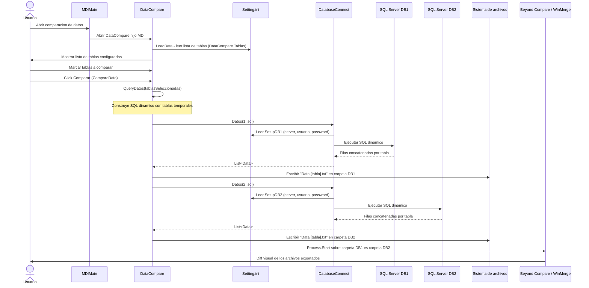

# Secuencia — Comparación de datos

Flujo independiente del de objetos: compara el contenido (filas) de tablas seleccionadas entre dos bases de datos.

## Diagrama de secuencia

## Notas de implementación

- Este flujo es **independiente** del de comparación de objetos: usa su propia conexión (`DatabaseConnect`, basada en `Setting.ini`) en lugar de `ObjectDB`/SMO.
- El SQL de comparación se construye concatenando el listado de tablas seleccionadas directamente en la cláusula `WHERE [FullName] IN (###)` (ver `QueryDatos()` en [`DataCompare.cs`](../DBCompare/DataCompare.cs)), sin parametrizar ni escapar comillas.
- La query final se ejecuta de forma dinámica con `EXEC (@Query)` dentro de un cursor T-SQL.
- Todo el proceso (`CompareData()`) se ejecuta de forma síncrona en el hilo de la UI: consultas a ambos servidores y escritura de archivos bloquean la interfaz durante el tiempo que tome el fetch.
- El comparador externo se invoca sobre **directorios completos** (uno por base de datos), no como un diff inline dentro de la aplicación.
- Existe un script `SQL_DATA_COMPARE.sql` embebido en `ObjectHelper` con una lógica equivalente que **no se usa**; esta duplicación implica mantener la misma lógica en dos lugares.

Ver hallazgos relacionados en [bugs-y-mejoras.md](bugs-y-mejoras.md) (sección "Comparación de datos").
