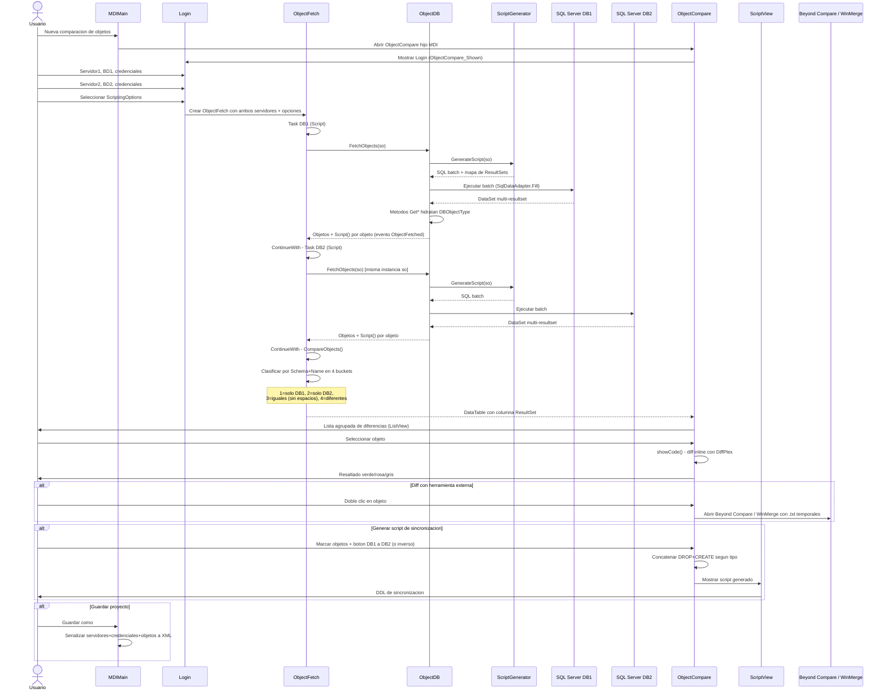

# Secuencia — Comparación de esquema (objetos)

Flujo principal de la aplicación: comparar la estructura (DDL) de dos bases de datos.

## Diagrama de secuencia

## Notas de implementación

- El fetch de DB1 y DB2 se ejecuta como una cadena de `Task.Factory.StartNew().ContinueWith(...).ContinueWith(...)` en [`ObjectFetch.cs`](../DBCompare/ObjectFetch.cs); no hay `TaskScheduler.FromCurrentSynchronizationContext()` explícito ni observación centralizada de excepciones no controladas.
- La misma instancia de `ScriptingOptions` (`so`) se reutiliza para ambos fetches. Si el primer servidor es de una versión antigua de SQL Server y deshabilita un flag (p. ej. `DataCompression`), esa mutación persiste para el segundo fetch aunque el segundo servidor sea más reciente.
- La clasificación en los 4 buckets compara únicamente por `Schema + Name` (ver `CompareObjects()` en `ObjectFetch.cs`), sin considerar el `Type`. Dos objetos de tipos distintos con el mismo esquema y nombre se tratarían como el mismo objeto.
- La igualdad entre definiciones ("bucket 3") se determina normalizando espacios en blanco (`RemoveWhiteSpaces`), no por comparación semántica del DDL.
- El guardado de proyecto en XML persiste las contraseñas de conexión en texto plano junto con la lista de objetos comparados.

Ver hallazgos relacionados en [bugs-y-mejoras.md](bugs-y-mejoras.md) (sección "Comparación de objetos").
