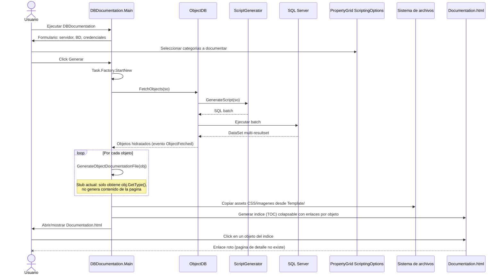

# Secuencia — Generación de documentación (DBDocumentation)

Aplicación secundaria que genera un índice HTML navegable del esquema de una base de datos.

## Diagrama de secuencia

## Notas de implementación

- El fetch reutiliza el mismo `ObjectDB`/`ScriptGenerator` que `DBCompare`, ejecutado en background con `Task.Factory.StartNew` y actualización de UI vía `Invoke` (sin comprobación consistente de `InvokeRequired`).
- `GenerateObjectDocumentationFile` (en [`Main.cs`](../DBDocumentation/Main.cs)) es un stub: obtiene el tipo del objeto pero no escribe ninguna página HTML de detalle.
- El resultado final es un índice (`toc.html`) cuyos enlaces apuntan a páginas de objeto que nunca se generan, por lo que la funcionalidad de documentación está incompleta en la práctica.
- El formulario `Main` de `DBDocumentation` tenía, antes de esta revisión, credenciales de ejemplo precargadas en el diseñador (ver corrección aplicada en [bugs-y-mejoras.md](bugs-y-mejoras.md)).

Ver hallazgos relacionados en [bugs-y-mejoras.md](bugs-y-mejoras.md) (sección "DBDocumentation").
